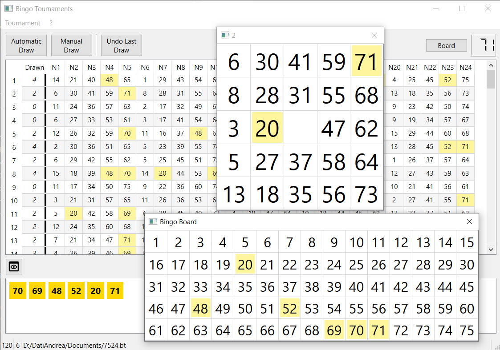

# Bingo Tournaments
Open-source Bingo manager built with Python and PySide6.
Supports multiple card formats, tournament creation, automatic/manual number draws, live card highlighting, and CSV/HTML export.
Designed with a clean Model/View architecture for easy extension.

Version 2.1

This project is a **free and open-source Python port** of the Windows application  
**“Bingo Tournament Software”**, originally developed by **the same author**.

Original Windows version (Microsoft Store):  
https://apps.microsoft.com/detail/9pgmhsxjt7fp

The Python version is a complete rewrite aimed at cross-platform compatibility and open-source distribution.

---

## Features

- Complete Bingo tournament management
- Unlimited bingo card generation
- Automatic and manual number drawing
- Bingo card printing and HTML export
- Export card in csv
- 60 numbers card support (20 numbers per card)
- 75 numbers card support (24 numbers per card, standard Bingo)
- 75 numbers card support (25 numbers per card)
- 90 numbers card support (15 numbers per card, italian Tombola/Bingo)
- 100 numbers card support (25 numbers per card)
- Cross-platform user interface (Qt / PySide6)

---

## Requirements

- Python 3.10 or newer
- PySide6

---

## Installation

1. Install Python from:  https://www.python.org
2. Install the required dependencies:  pip install -r requirements.txt
3. Run:  py main.py

## Usage

1. Create a new tournament or load an existing one.
2. Generate Bingo cards.
3. Draw numbers automatically or manually.
4. Highlighted numbers show which have been drawn.
5. Export cards or results for sharing.

### Main Window with card and board (non modal windows)

